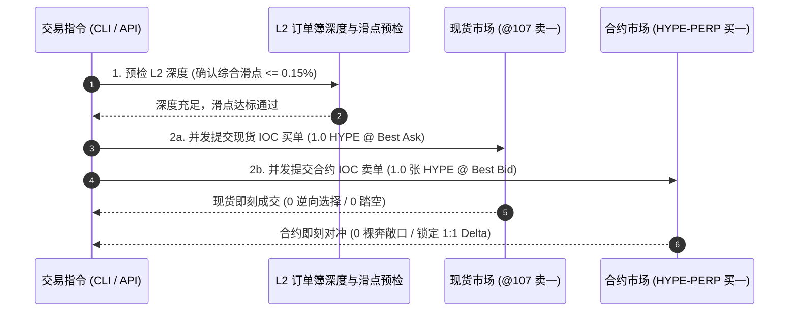

# Hyperliquid 1 个 HYPE Delta-Neutral 资金费率套利实操指南

本手册记录在 Hyperliquid 上构建 **1 个 HYPE 现货多头 + 1 个 HYPE 永续合约空头** 的 1:1 Delta 绝对中性资金费率套利方案，涵盖 CLI 命令行、Web REST API、Python SDK 执行指令、方案 D 资金分配与阶梯风控 SOP。

---

## 1. 核心建仓命令快速索引 (Quick Commands)

### 1.1 CLI 运维命令行 (`scripts/hl_ops.py`)

系统内置了自动化套利计划构建与执行工具，支持演练（Dry-Run）与实盘（Live）模式，**默认采用 `taker_taker`（双边快速市价/IOC 吃单，0 逆向选择风险）**：

```bash
# 1. 演练构建 1 个 HYPE 建仓计划 (默认 Dry-Run 与 Taker-Taker 模式)
python3 scripts/hl_ops.py arbitrage --coin HYPE --qty 1

# 2. 实盘提交建仓 (使用 Gopass 内存注入 API Wallet 私钥，并发双边吃单锁定 Delta)
gopass env trading/hyperliquid python3 scripts/hl_ops.py arbitrage --coin HYPE --qty 1 --force

# 3. 输出原始 JSON 数据 (供程序或自动化脚本调用)
python3 scripts/hl_ops.py arbitrage --coin HYPE --qty 1 --json

# 4. 可选：显式切换为 Maker-Taker 挂单模式 (低波动时期节省手续费)
python3 scripts/hl_ops.py arbitrage --coin HYPE --qty 1 --mode maker_taker
```

### 1.2 Web REST API 接口 (Curl)

本地后台服务启动后（`python3 server.py --port 8000`），可通过标准 HTTP GET 请求获取结构化建仓演练计划（默认 `taker_taker`）：

```bash
curl -s "http://localhost:8000/api/build-arbitrage?exchange=hyperliquid&symbol=HYPE&spot_symbol=@107&amount_qty=1" | jq .
```

### 1.3 常用全局别名极速调用 (推荐配置)

```bash
# 执行建仓演练
hl-ops arbitrage --coin HYPE --qty 1

# 查看账户当前健康度与持仓
hl-ops status

# 监控活动挂单
hl-ops orders
```

---

## 2. 标的资产与底层市场参数 (HYPE Market Spec)

| 参数项 | 参数值 | 说明 |
| :--- | :--- | :--- |
| **永续合约标的** | `HYPE` (Perp Index: 159) | 最大杠杆 10x，数量精度 `szDecimals = 2` |
| **现货交易对** | `@107` (`HYPE/USDC`) | 底层代币 Index 150 (`HYPE`) + Quote Index 0 (`USDC`) |
| **合约乘数 Multiplier** | `1.0` | 1 现货对应 1 张永续合约，无缩放乘数 |
| **现货质押属性** | **支持质押 (65% LTV)** | Portfolio Margin 模式下享有 65% 折算率 (35% Haircut) |
| **结算币种** | `USDC` | 资金费与现货结算均为 USDC |

---

## 3. 方案 D 资金分配与量化风控矩阵 (Scheme D Model)

以建仓 **1.0 HYPE**（假设市价 $P_0 = \$80.50\text{ USD}$）为例：

```
┌────────────────────────────────────────────────────────────────────────┐
│                   总本金需求 C ≈ $89.44 USDC                           │
├───────────────────────────────────┬────────────────────────────────────┤
│ 1. 现货资产 (90% 权重)            │ 2. 现金缓冲池 (10% 权重)           │
│    • 买入 1.0 HYPE ($80.50 USD)   │    • 闲置 $8.94 USDC               │
│    • 65% LTV 质押折算: $52.32     │    • 零交易摩擦流动性吸收器        │
├───────────────────────────────────┴────────────────────────────────────┤
│ 3. 永续空头对冲 (1:1 Delta 中性)                                       │
│    • 做空 1.0 张 HYPE-PERP ($80.50 USD 名义价值)                       │
│    • Delta = +1.0 (现货) - 1.0 (合约) = 0.0 (绝对中性)                 │
└────────────────────────────────────────────────────────────────────────┘
```

### 3.1 资金分配明细表

| 资产组成 | 分配权重 | 资金占用 (USD) | 抵押物/对冲属性 | 核心量化风控作用 |
| :--- | :---: | :---: | :--- | :--- |
| **1. 现货 HYPE 多头** | **90.0%** | **$80.50 USD** | 65.0% LTV 质押 (折算 **$52.32** 保证金) | 全额转为抵押物，享受跨资产保证金支持 |
| **2. 永续 HYPE 空头** | **90.0%** | **$80.50 USD** | 1:1 对冲 (持仓 -1.0 张) | 消除价格波动风险，持续捕获资金费率 |
| **3. USDC 现金储备** | **10.0%** | **$8.94 USDC** | 100.0% 流动性现金 | 应对突发极端暴涨，Level 1 调拨注入 |
| **总计总本金** | **100.0%** | **$89.44 USDC** | **资金利用率: 90.0%** | **实际年化 APR = $0.90 \times \text{Funding APR}$** |

### 3.2 强平安全距离推导 ($P_{\text{liq}}$)

- **维持保证金率 (MMR)**：$3\%$
- **抵押品折算率 ($\alpha$)**：$65\%$ ($35\%$ Haircut)
- **现金储备率 ($\beta$)**：$10\%$
- **理论强平价公式**：
  $$P_{\text{liq}} = \frac{P_0}{1.0 - 0.65 \times 0.90 - 0.90 \times (1 - \text{MMR})} \approx \frac{P_0}{0.342} \approx \mathbf{2.924 \times P_0}$$
- **安全边界**：$P_{\text{liq}} = 2.924 \times \$80.50 \approx \mathbf{\$235.38}$，标的价格需单边暴涨 **$+192.4\%$**（接近翻 3 倍）才会触及强平。

---

## 4. 双腿订单执行时序与 SOP (Taker-Taker Default Execution)

为了彻底消除**挂单暴露免费期权（Adverse Selection）**与行情急跌时的**单腿网络延迟（Legging Latency）**断头铡风险，建仓默认采用 **Taker-Taker 双边快速 IOC 吃单架构**：



### 4.1 双腿委托明细 (Taker-Taker 默认)

1. **Leg 1 (现货买入)**：
   - **标的**：`@107` (`HYPE/USDC`)
   - **方向**：`BUY`
   - **数量**：`1.00 HYPE`
   - **委托价格**：盘口卖一价或滑点保护限价值（Best Ask）
   - **订单类型**：`IOC` (`{"limit": {"tif": "Ioc"}}`)
   - **费率**：Taker 费率 **`0.0672%`**
2. **Leg 2 (合约做空)**：
   - **标的**：`HYPE` (Perp)
   - **方向**：`SELL`
   - **数量**：`1.00 张`
   - **委托价格**：盘口买一价（Best Bid）
   - **订单类型**：`IOC` (`{"limit": {"tif": "Ioc"}}`)
   - **费率**：Taker 费率 **`0.0432%`**

### 4.2 为什么必须以 Taker-Taker 为默认标准？

| 风险维度 | Maker-Taker (挂单触发) | Taker-Taker (双边 IOC 市价 - 默认) |
| :--- | :--- | :--- |
| **逆向选择 (Adverse Selection)** | ❌ **严重**：暴跌时机构优先砸向你的买单，必吃飞刀 | ✅ **零风险**：主动吃单，消灭暴露期权 |
| **单腿裸奔敞口** | ❌ **存在 50~200ms 延迟**，暴跌时合约来不及对冲 | ✅ **零敞口**：两腿并发原子成交 |
| **交易确定性** | ❌ 上涨踏空，暴跌被割 | ✅ 100% 确定成交并锁定 Delta 中性 |
| **手续费差异** | 综合进场 0.0576% | 综合进场 0.1104% (差异仅 ~0.0528%，~15 小时资金费即平平) |

---

## 5. Python 原生自动化建仓脚本示例

如需通过 Python 脚本实现自定义自动化，可直接调用系统的 [`HyperliquidExecutor`](file:///home/dave/src/github/xiluo/capital-rate-arbitrage/src/hyperliquid_executor.py)：

```python
#!/usr/bin/env python3
"""
Hyperliquid 1 HYPE Delta-Neutral Arbitrage Builder
"""
import json
from src.hyperliquid_executor import HyperliquidExecutor

def main():
    # 初始化执行器 (自动从环境变量或 gopass 读取配置)
    executor = HyperliquidExecutor()

    # 1. 构造 1 HYPE 套利方案
    plan = executor.build_arbitrage_plan(
        coin="HYPE",
        amount_qty=1.0,
        execution_mode="maker_taker"
    )

    print(json.dumps(plan, indent=2, ensure_ascii=False))

    # 2. 模拟演练 (Dry-Run)
    sim_res = executor.execute_arbitrage_plan(plan, dry_run=True)
    print("\nDry-Run 结果:", sim_res)

    # 3. 如需实盘提交 (取消以下注释):
    # live_res = executor.execute_arbitrage_plan(plan, dry_run=False)
    # print("\n实盘挂单结果:", live_res)

if __name__ == "__main__":
    main()
```

---

## 6. 持仓运维与三级阶梯风控 SOP (Post-Trade Risk Management)

建仓完成后，通过以下命令维持仓位监控与阶梯风控：

### 6.1 实时健康度查看
```bash
python3 scripts/hl_ops.py status
```
监控保证金使用率（Margin Utilization）与强平安全距离。

### 6.2 三级阶梯应急动作
- **Level 1 (现金缓冲注入)**：
  - **触发**：保证金使用率 $> 60\%$ 或 距强平 $< 25\%$。
  - **动作**：将 10% 闲置 USDC 划入 Perp 保证金（0 手续费、0 滑点）：
    ```bash
    python3 scripts/hl_ops.py transfer --to perp --amount 8.94
    ```
- **Level 2 (等比减仓变现)**：
  - **触发**：保证金使用率 $> 75\%$ 或 距强平 $< 15\%$。
  - **动作**：按比例同时卖出 25% 现货并平掉 25% 合约空头：
    ```bash
    python3 scripts/hl_ops.py deleverage --coin HYPE --pct 25
    ```
- **Level 3 (紧急熔断)**：
  - **触发**：距强平 $< 8\%$。
  - **动作**：紧急市价平掉 $\ge 50\%$ 头寸消除穿仓风险：
    ```bash
    python3 scripts/hl_ops.py deleverage --coin HYPE --pct 50 --force
    ```
- **紧急一键全撤单 (Panic Button)**：
  ```bash
  python3 scripts/hl_ops.py cancel-all --coin HYPE
  ```

---

## 7. 离场平仓标准 (Exit Criteria)

1. **费率衰减**：当 3 日移动平均资金费率 $< 5\%$ APR 或持续转负时，择机离场。
2. **平仓时序**：以 Maker 挂单平仓，先在现货端挂卖单，成交后毫秒级在合约端以 IOC 买平空头，回收 100% USDC 本息。
