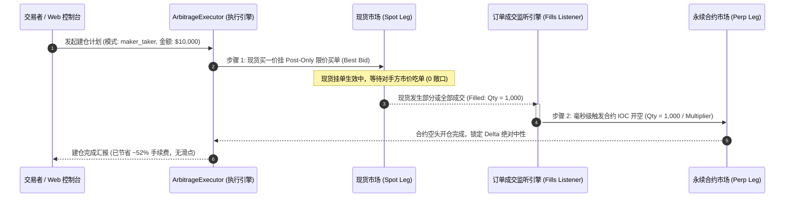

# Delta-Neutral 资金费率套利 Maker-Taker 触发对冲执行架构规范

本手册系统阐述资金费率套利中 **“现货 Post-Only Maker 挂单 + 成交后毫秒级触发合约 IOC/Market Taker 对冲”**（Maker-Taker Trigger Hedge）架构的设计原理、数学费率模型、事件驱动流程与量化风控规范。

---

## 1. 架构演进背景与痛点破解

在加密货币 Delta-Neutral 资金费率套利（现货买入多头 + 合约做空对冲）的工程实践中，订单执行方式决定了策略的长期净收益与生存边界。

```
                              套利建仓执行的三种路线
                                       │
     ┌─────────────────────────────────┼─────────────────────────────────┐
     ▼                                 ▼                                 ▼
【双边市价 Taker-Taker】           【双边挂单 Maker-Maker】          【推荐: Maker-Taker 触发对冲】
  • 确定性最高，0 单腿敞口           • 手续费最低 (享受双边 Maker)       • 现货做 Maker，合约做 Taker
  • ❌ 现货吃单费率极贵 (0.07%~0.1%)  • ❌ 存在致命“单腿裸奔”风险         • ✅ 现货省下 50%~70% 手续费与滑点
  • ❌ 盘口冲击滑点巨大              • ❌ 一腿成交另一腿未成交时遭遇暴跌    • ✅ 成交后毫秒级对冲，0 裸奔敞口
```

### 1.1 为什么必须采用“现货 Maker，合约 Taker”？

1. **现货市场：手续费最昂贵、流动性最薄弱**：
   - 现货 Taker 费率极高（Hyperliquid 0.070%、Bybit 0.100%），且山寨币现货挂单簿深度较浅。
   - 若现货端使用 Taker 市价吃单，不仅要支付高昂手续费，还会承受巨大的冲击滑点（Slippage $\ge 0.3\% \sim 0.8\%$），吞噬数天的资金费收益。
   - **解决方案**：现货端必须使用 **Post-Only (Alo) 纯挂单**，挂在买一价（Best Bid），**实现 0 滑点并在成交时享受极低的 Maker 费率**（Hyperliquid 0.015% / Bybit 0.00%~0.02%）。

2. **合约市场：手续费便宜、流动性极其深厚**：
   - 合约 Taker 费率低廉（Hyperliquid 0.035%、Bybit 0.055%），且主流币与主流山寨币合约盘口的瞬时承载力远高于现货。
   - **解决方案**：现货一旦成交（哪怕是 $100 的部分成交），程序监听到事件后，**在几十毫秒内以市价/IOC (Immediate-or-Cancel) 在合约端开出等量空头**。单腿暴露时间极短（$< 50\text{ms}$），彻底消除单边行情暴跌风险。

---

## 2. 数学模型与费用对比

### 2.1 进场与双边平仓费率公式

$$\begin{aligned}
\text{Entry Fee}_{\text{MT}} &= \text{Spot Maker Fee} + \text{Perp Taker Fee} \\
\text{Entry Fee}_{\text{TT}} &= \text{Spot Taker Fee} + \text{Perp Taker Fee} \\
\text{Fee Savings \%} &= \text{Entry Fee}_{\text{TT}} - \text{Entry Fee}_{\text{MT}} = \text{Spot Taker Fee} - \text{Spot Maker Fee}
\end{aligned}$$

### 2.2 主流交易所量化对比表

| 交易所 | 模式 | 现货费率 | 合约费率 | 综合进场费率 | 双边出入场摩擦 | 手续费节省比例 |
| :--- | :--- | :---: | :---: | :---: | :---: | :---: |
| **Hyperliquid** | **Maker-Taker (推荐)** | **0.015%** (Alo) | **0.035%** (Ioc) | **0.050%** | **0.100%** | **🔥 节省 52.4%** |
| Hyperliquid | Taker-Taker (全市价) | 0.070% | 0.035% | 0.105% | 0.210% | 基准 |
| **Bybit** | **Maker-Taker (推荐)** | **0.020%** (PostOnly) | **0.055%** (Market) | **0.075%** | **0.150%** | **🔥 节省 51.6%** |
| Bybit | Taker-Taker (全市价) | 0.100% | 0.055% | 0.155% | 0.310% | 基准 |

> **回本时间效益**：
> 以年化 APR 30%（每小时 0.00342%）标的为例：
> - **Taker-Taker 进场**：需要 $\frac{0.105\%}{0.00342\%} = \mathbf{30.7\text{ 小时}}$ 才能覆盖进场手续费。
> - **Maker-Taker 进场**：仅需 $\frac{0.050\%}{0.00342\%} = \mathbf{14.6\text{ 小时}}$ 即可回本，**回本效率提升一倍以上**！

---

## 3. 架构拓扑与事件驱动流程 (Event-Driven Workflow)



---

## 4. 挂单风控与超时追单 SOP (Maker Timeout & Reprice SOP)

在实际挂单过程中，若标的价格持续上涨，可能导致买一挂单远离最新盘口而无法成交。系统遵循如下风控纪律：

```
                              现货 Maker 挂单生命周期管理
                                           │
                                  [现货买一挂单发出]
                                           │
                        ┌──────────────────┴──────────────────┐
                        ▼                                     ▼
                  【30 秒内完全成交】                    【30 秒内未完全成交】
                        │                                     │
                        ▼                                     ▼
             [毫秒级触发合约对冲，建仓完成]            [检查买一价格偏离率 ΔP]
                                                              │
                                            ┌─────────────────┴─────────────────┐
                                            ▼                                   ▼
                                     【ΔP <= 0.15%】                     【ΔP > 0.15%】
                                     继续等待成交 (重置定时器)          自动撤销旧挂单，重新以最新买一挂单
```

1. **部分成交（Partial Fill）增量对冲**：
   - 现货无论成交任何数量 $\Delta Q_{\text{spot}}$，监听器必须立即触发合约等量对冲：
     $$\Delta \text{Contracts}_{\text{perp}} = \frac{\Delta Q_{\text{spot}}}{\text{Multiplier}}$$
2. **挂单超时撤单与追单 (Reprice / Chase)**：
   - 若现货挂单挂出超过 **30 秒** 未成交，且买一价上移幅度 $> 0.15\%$，系统执行**撤单重挂（Cancel & Replace）**。
   - 若累计重挂达 3 次仍未成交，且资金费率或基差已恶化，自动放弃建仓并告警。

---

## 5. 代码组件设计与接口说明

### 5.1 数学与费率模型 ([`src/calculator.py`](file:///home/dave/src/github/xiluo/capital-rate-arbitrage/src/calculator.py))
- `get_entry_fee_rate(mode="maker_taker")`：返回对应模式的单边开仓费率。
- `get_roundtrip_fee_rate(mode="maker_taker")`：返回双边平仓费率。
- `evaluate_capital_capacity(..., execution_mode="maker_taker")`：
  - 在 `maker_taker` 模式下，现货滑点自动设为 `0.00%`（限价挂单），合约滑点走 L2 卖单深度模拟；
  - 动态计算并返回 `fee_savings_usd` 与对比回本时间。

### 5.2 建仓计划引擎 ([`src/bybit_executor.py`](file:///home/dave/src/github/xiluo/capital-rate-arbitrage/src/bybit_executor.py))
- `generate_try_run_plan(..., execution_mode="maker_taker")`：
  - 现货腿：`order_type: "Limit (Post-Only / Maker)"`，`target_price: spot_maker_px`，`time_in_force: "PostOnly"`。
  - 合约腿：`order_type: "Market / IOC (Taker)"`，`role: "Hedge Leg (成交毫秒对冲)"`。
  - 返回字典包含 `fee_savings_pct`、`fee_savings_usd` 与结构化流程说明 `workflow_desc`。

### 5.3 Hyperliquid 执行器 ([`src/hyperliquid_executor.py`](file:///home/dave/src/github/xiluo/capital-rate-arbitrage/src/hyperliquid_executor.py))
- `build_maker_taker_order_plan(...)`：构建符合 Hyperliquid EIP-712 标准的 `Alo` (Add Liquidity Only) 现货挂单与 `Ioc` 合约对冲指令。

### 5.4 REST API 端点 ([`server.py`](file:///home/dave/src/github/xiluo/capital-rate-arbitrage/server.py))
- 支持在 `/api/bybit/build-arbitrage` 与 `/api/depth-capacity` 中通过查询参数 `&execution_mode=maker_taker`（或 `taker_taker`）动态获取建仓演练计划。

---

## 6. 测试与验证命令 (Verification Commands)

### 6.1 单元测试套件
```bash
# 运行全部 39 项单元测试
python3 -m unittest discover -s tests

# 专门测试计算器 Maker-Taker 费率模型
python3 -m unittest tests/test_calculator.py

# 专门测试建仓计划引擎
python3 -m unittest tests/test_bybit_executor.py

# 专门测试 Hyperliquid Ops 订单构建
python3 -m unittest tests/test_hyperliquid_ops.py
```

### 6.2 启动 Web 控制台验证
```bash
python3 server.py --port 8000
```
访问 `http://localhost:8000`，在任意资产点击 **[🚀 建仓演练]**：
- 可自由在 `⚡ Maker-Taker` 与 `🚀 Taker-Taker` 之间切换；
- 实时观察手续费节省额（`💰 节省手续费: +0.055%`）、回本时间缩短倍数及清晰的订单挂单明细。
